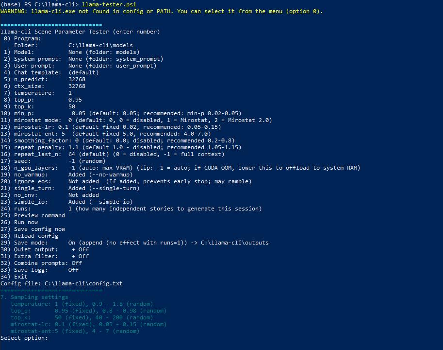

# llama-cli Scene Parameter Tester



This program just uses the same system prompt and user prompt and makes several runs using different parameters. 

This program is run in Windows powershell, so if you have windows most likely you just need to type powershell in search box and start this app.

Output length depends on the model and settings.
Different LLMs have different maximum output limits per response. Some models can produce very long single responses (several thousand words), while others tend to stop sooner or are capped by lower output-token limits.

This program has been created by chatgpt and claude haiku 4.5. Rest of this readme is done by claude 4.5.

A comprehensive PowerShell-based testing and parameter tuning tool for [llama.cpp](https://github.com/ggml-org/llama.cpp) and llama-cli.exe. This tool provides an interactive menu-driven interface to experiment with different LLM parameters, prompts, and sampling configurations without writing command-line arguments manually.

## Features

- **Interactive Menu System** - Easy-to-use numbered menu for configuring all parameters
- **Multiple Model Folders** - Switch between different model directories on the fly
- **Program & Folder Configuration** - Change llama-cli.exe location and model folder paths
- **Flexible Model Selection** - Browse and select .gguf model files from any folder
- **Prompt Management** - Organize system prompts and user prompts in dedicated folders
- **Chat Templates** - Choose built-in or custom chat templates
- **Advanced Sampling Controls**:
  - Temperature, top_p, top_k settings
  - Mirostat mode (v1 and v2) with configurable parameters
  - Min_p, smoothing factor, and repeat penalties
  - Per-run and global sampling profiles
- **GPU Acceleration** - Configure GPU layer offloading (n_gpu_layers)
- **Multi-Run Testing** - Generate multiple independent outputs in a single session
- **Output Saving** - Save results with append or separate file modes
- **Logging** - Optional logging of all output
- **Combined Prompts** - Mix system and user prompts into a single override
- **Config Persistence** - All settings saved to config.txt for quick restoration
- **Preview Command** - See the exact llama-cli command before running
- **Quiet Output Mode** - Hide banners and model info to see only responses

## Requirements

- **PowerShell 5.1+** (Windows)
- **llama-cli.exe** from [llama.cpp](https://github.com/ggml-org/llama.cpp) (ggml-org/llama.cpp releases)
- **.gguf Model Files** - Compatible quantized models (GGUF format)

## Installation

1. Clone or download this repository
2. Place your `llama-cli.exe` in a known location
3. Create or link your models folder containing .gguf files
4. Run the main script:
   ```powershell
   .\llama-tester.ps1
   ```

## Directory Structure

```
llama-cli-scene-parameter-tester/
├── llama-tester.ps1              # Main entry point
├── config.txt                    # Persisted configuration (auto-created)
├── sampling-config.json          # Sampling parameter presets
├── core/
│   ├── llama-core.ps1           # Core functions and config management
│   ├── menu.ps1                 # Interactive menu system
│   └── prompt-combine.ps1       # Prompt combining utilities
├── models/                       # Your GGUF model files (configure folder in menu)
├── system_prompt/               # System prompt templates (.txt files)
├── user_prompt/                 # User prompt templates (.txt files)
├── templates/                   # Chat template files
├── outputs/                     # Generated outputs
├── combined_prompt/             # Combined prompt storage
├── combined_formats/            # Combined prompt profiles
└── README.md
```

## Quick Start

1. Run the program:
   ```powershell
   .\llama-tester.ps1
   ```

2. Configure via the menu:
   - **Option 0**: Set program location and model folder
   - **Option 1**: Select your model file
   - **Option 2**: Choose system prompt
   - **Option 3**: Choose user prompt
   - **Options 5-23**: Adjust generation and sampling parameters

3. **Option 25**: Preview the command that will be executed
4. **Option 26**: Run and generate output
5. **Option 27**: Save configuration
6. **Option 34**: Exit

## Configuration

All settings are automatically saved to `config.txt` and restored on next run. You can also manually edit `config.txt` with any text editor.

Key settings include:
- `llama_exe_path` - Path to llama-cli.exe
- `model_folder` - Directory containing .gguf files
- `model_name` - Selected model file
- `n_predict` - Number of tokens to generate
- `ctx` - Context size
- `temperature`, `top_p`, `top_k` - Sampling parameters
- `mirostat_mode` - Mirostat sampling (0=off, 1=v1, 2=v2)
- `n_gpu_layers` - GPU layer offloading (-1 = auto)
- `runs` - Number of independent generations per session

## Parameter Guide

### Generation Parameters
- **n_predict** (-n): Tokens to generate. -1 = infinite, -2 = fill context
- **ctx_size** (-c): Context window size (must match model capability)
- **seed** (-s): Random seed. -1 = random seed each run

### Sampling Parameters
- **temperature**: Higher = more creative (default 0.8, range 0-2+)
- **top_p**: Nucleus sampling threshold (default 0.95)
- **top_k**: Top-K sampling (default 40)
- **min_p**: Minimum token probability (default 0.05)
- **repeat_penalty**: Penalize token repetition (default 1.1)

### Mirostat (Advanced)
- **Mode 1**: Original Mirostat algorithm
- **Mode 2**: Mirostat 2.0 (improved, recommended)
- **mirostat_lr**: Learning rate for target entropy
- **mirostat_ent**: Target entropy value

### GPU Acceleration
- **n_gpu_layers**: Number of layers to offload to GPU
  - `-1` = Auto (use maximum available VRAM)
  - `0` = CPU only
  - `>0` = Specific layer count

## Tips & Best Practices

1. **Start Simple**: Begin with default parameters and adjust one at a time
2. **Use Preview Mode**: Always check Option 25 (Preview command) before running
3. **Save Often**: Use Option 27 to save configurations you like
4. **Multi-Run Testing**: Use the `runs` parameter to compare outputs with same settings
5. **GPU Memory Issues**: If getting CUDA out-of-memory, reduce `n_gpu_layers`
6. **Model Selection**: Verify your .gguf file is in the configured model folder
7. **Prompts**: Create reusable prompts in system_prompt/ and user_prompt/ folders

## Logging & Output

- **Save Mode**: Choose between "append" (multi-run sections) or "separate" (individual files)
- **Quiet Output**: Enable to see only the model response (hides setup text)
- **Extra Filter**: Additional filtering of output
- **Logging**: Save conversation history to logg.txt

## Troubleshooting

**"No .gguf models found"**
- Verify models are in the configured folder (Option 0 → Option 2)
- Ensure files have .gguf extension

**"llama-cli.exe not found"**
- Set correct path in Option 0 → Option 1
- Verify llama-cli.exe exists at that location

**CUDA out of memory**
- Reduce `n_gpu_layers` (Option 18)
- Use a smaller or more quantized model
- Reduce context size (Option 6)

**Slow generation**
- Increase `n_gpu_layers` for GPU acceleration
- Verify llama-cli is using GPU (check command preview)
- Try a smaller model

## Links

- [llama.cpp Repository](https://github.com/ggml-org/llama.cpp)
- [GGUF Model Format](https://github.com/ggml-org/ggml/blob/master/docs/gguf.md)
- [Hugging Face GGUF Models](https://huggingface.co/models?sort=downloads&search=gguf)

## License

This tool is provided as-is for testing and experimentation with llama.cpp

---

**Enjoy testing your LLM parameters!** 🚀
